# PR Flow Skill — Better PRs with Claude Code



---

## Overview

A Claude Code skill that orchestrates a structured PR workflow — from intent definition through GitHub Issues, parallel enrichment, grouped implementation, and clean PR delivery.

### Installation

Copy the `pr-flow-skill/` folder into your Claude Code skills directory:

```bash
cp -r pr-flow-skill/ ~/.claude/skills/pr-flow/
```

Then invoke with:

```
/pr-flow <your intent here>
```

### Skill file

See [`SKILL.md`](./SKILL.md) for the full skill definition that Claude Code executes.

---

## Flow for Better PRs with Claude Code

1. **Define intent** — Tell Claude your intent upfront. Prompt it to validate each intention individually and document them as GitHub Issues, referencing the specific code they relate to.

2. **Reset context** — `/clear` or `/compact`. This is critical — you want the next phase to start fresh without the noise from the planning conversation.

3. **Validate issues** — Open the issues and double-check them independently. Make sure each one is accurate, scoped correctly, and not missing anything before any code gets written.

4. **Enrich with parallel subagents** — Tell Claude to spawn parallel subagents, one per issue, to add context, root cause analysis, and proposed solutions as comments on each GitHub Issue.

5. **Reset context again** — `/compact` or `/clear` before moving into implementation.

6. **Group and implement** — Give Claude the list of issues to work through. It should group related issues logically, solve them by issue reference (makes review trivial later), write tests, fix regressions, and delete outdated tests.

7. **Track with checklist.md** — Instruct Claude to maintain a local `checklist.md` to track its own progress across the issue groups. This fights context rot mid-session. Critical: it must never be committed.

8. **Open PR per group** — Each group gets its own PR to the target branch, with a description that explicitly references the issues it resolves.

9. **Delete checklist.md** — Remind Claude to delete it before opening the PR. Local scratchpad only, never in git history.
